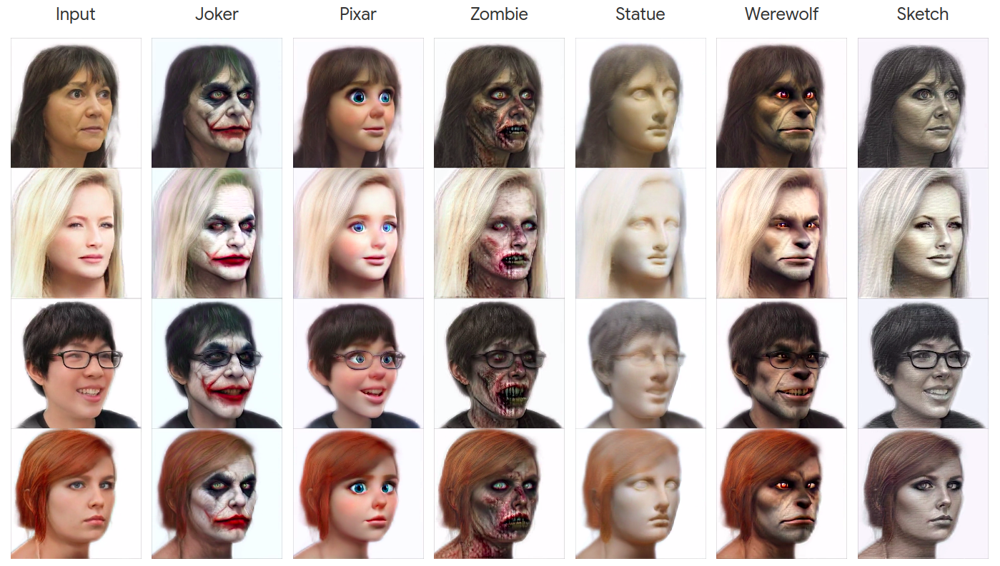

# Identity Preserving 3D Head Stylization with Multiview Score Distillation

[Bahri Batuhan Bilecen](https://three-bee.github.io), [Ahmet Berke Gokmen](https://berkegokmen1.medium.com/), Furkan Guzelant, and [Aysegul Dundar](http://www.cs.bilkent.edu.tr/~adundar/)

[](https://opensource.org/licenses/Apache-2.0) [](https://three-bee.github.io/head_stylization/)



3D head stylization transforms realistic facial features into artistic representations, enhancing user engagement across gaming and virtual reality applications. While 3D-aware generators have made significant advancements, many 3D stylization methods primarily provide near-frontal views and struggle to preserve the unique identities of original subjects, often resulting in outputs that lack diversity and individuality. This paper addresses these challenges by leveraging the PanoHead model, synthesizing images from a comprehensive 360-degree perspective. We propose a novel framework that employs negative log-likelihood distillation (LD) to enhance identity preservation and improve stylization quality. By integrating multi-view grid score and mirror gradients within the 3D GAN architecture and introducing a score rank weighing technique, our approach achieves substantial qualitative and quantitative improvements. Our findings not only advance the state of 3D head stylization but also provide valuable insights into effective distillation processes between diffusion models and GANs, focusing on the critical issue of identity preservation.

## 🛠️ Requirements and installation
* Make sure you have 64-bit Python 3.8, PyTorch 11.1 (or above), and CUDA 11.3 (or above).
* Preferably, create a new environment via [conda](https://conda.io/projects/conda/en/latest/user-guide/tasks/manage-environments.html) or [venv](https://docs.python.org/3/library/venv.html) and activate the environment.
* Clone repository: ```git clone --recursive https://github.com/three-bee/3d_head_stylization.git```
* Install pip dependencies: ```cd ./3d_head_stylization && pip install -r requirements.txt```

## :scissors: Dataset preparation
We follow [PanoHead's approach](https://github.com/NVlabs/eg3d/?tab=readme-ov-file#preparing-datasets) for pose extraction and face alignment.  For this, you need to follow the setup procedure of PanoHead and ensure that you **do not skip** the setup of [3DDFA_V2](https://github.com/cleardusk/3DDFA_V2). Then, run [```PanoHead/projector_withseg.py```](https://github.com/SizheAn/PanoHead/blob/17ad915941c7e2703d5aa3eb5ff12eac47c90e53/projector_withseg.py#L330) and omit the ```project_pti``` stage, to only perform W+ encoding.

For your convenience, we provide W+ latents of several real-life identities in ```example``` folder.

## :checkered_flag: Checkpoints
Download all networks to your desired locations. We also provide stylized generator checkpoints for several prompts [in this link](https://drive.google.com/drive/folders/1P62hXsuOPbSGEhwFd4RtRWL7nzf44hRD?usp=sharing).
|        **Network**        |         **Filename**        |         **Location**        |
|:-------------------------:|:---------------------------:|:---------------------------:|
| [PanoHead](https://drive.google.com/drive/folders/1m517-F1NCTGA159dePs5R5qj02svtX1_) | ```easy-khair-180-gpc0.8-trans10-025000.pkl```   | ```${G_ckpt_path}```   |
|        [RealisticVision v5.1](https://huggingface.co/SG161222/Realistic_Vision_V5.1_noVAE) | ```Realistic_Vision_V5.1_noVAE/``` | ```${diff_ckpt_path}```   |
|  [ControlNet edge](https://huggingface.co/lllyasviel/sd-controlnet-edge) | ```sd-controlnet-canny/```   | ```${controlnet_edge_path}```   |
|      [ControlNet depth](https://huggingface.co/lllyasviel/sd-controlnet-depth) | ```sd-controlnet-depth/```              | ```${controlnet_depth_path}```   |
|       [DepthAnythingV2](https://github.com/DepthAnything/Depth-Anything-V2) | ```depth_anything_v2_vitb.pth```           | ```${depth_path}```   |


## :rocket: Quickstart
Change ```${stylized_G_ckpt_path}``` with checkpoint paths given [in this link](https://drive.google.com/drive/folders/1P62hXsuOPbSGEhwFd4RtRWL7nzf44hRD?usp=sharing). ```example``` folder provides several real-life W+ encoded heads. Giving an invalid path to ```latent_list_path``` will stylize ```synth_sample_num``` of synthetic samples.
```
python infer_LD.py \
    --save_path "work_dirs/demo" \
    --G_ckpt_path ${G_ckpt_path} \
    --stylized_G_ckpt_path ${stylized_G_ckpt_path} \
    --latent_list_path "example" \
    --synth_sample_num 10
```
## :running: Training
Change ```prompt``` and ```save_path```. You may play with other hyperparameters in the training file.
```
python train_LD.py \
    --prompt "Portrait of a werewolf" \
    --save_path "work_dirs/demo" \
    --diff_ckpt_path ${diff_ckpt_path} \
    --depth_path ${depth_path} \
    --G_ckpt_path ${G_ckpt_path} \
    --controlnet_edge_path ${controlnet_edge_path} \
    --controlnet_depth_path ${controlnet_depth_path}
```


## :incoming_envelope: Citation


Copyright 2024 [Bilkent DLR](https://dlr.bilkent.edu.tr/). Licensed under the Apache License, Version 2.0 (the "License").
